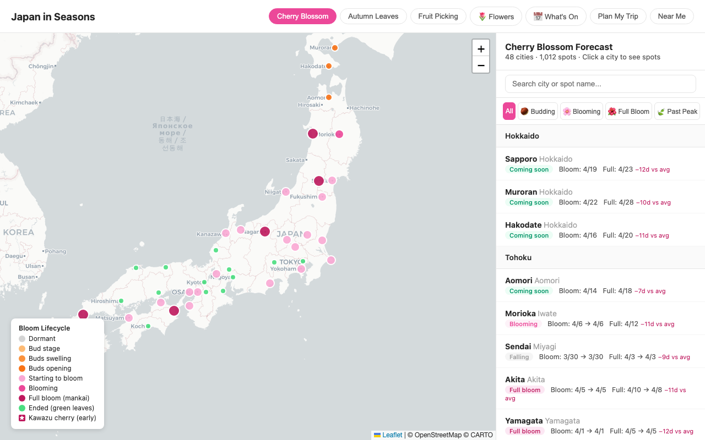

# create-mcp

A Claude Code skill for the full MCP development lifecycle. Start with an idea, end with a published server that AI clients can discover, cite, connect to, and use.



---

## What's an MCP?

MCP (Model Context Protocol) is an open standard that lets AI clients like Claude, Cursor, and Windsurf call real APIs and data sources. Instead of the AI working only from what it was trained on, it can call your live APIs, query your database, or pull real-time data on demand.

The protocol is picking up quickly. Anthropic, OpenAI, Google DeepMind, and dozens of developer tools now support it. Developers are publishing MCP servers for GitHub, Jira, Stripe, internal databases, public APIs — anything an AI agent might need to call.

If you have data or a service that would be more useful with AI access, an MCP server is how you expose it.

---

## The problem with building MCPs

The protocol itself isn't complicated. What's annoying is everything around it.

Getting a tool description right matters more than it looks. AI clients use descriptions to decide which tool to call and when. A vague or missing description means the client either skips your tool or calls it wrong. The same goes for parameter descriptions, server instructions, caching, error handling — every dimension affects how useful the server actually is, and how well it ranks on directories like Smithery.

Most developers ship something that works locally and then wonder why nobody finds it. A second common trap: a model may find your MCP page in ChatGPT Search, but that does not mean the chat can execute your MCP tools. Search visibility and MCP tool execution are separate surfaces.

---

## What this skill does

`create-mcp` is a Claude Code skill — a markdown file that gives Claude a structured workflow when you run `/create-mcp`. Claude reads the skill and follows the workflow, asking the right questions, making decisions, and doing the work.

Two paths, auto-detected:

**Starting from scratch** — Claude asks about your data source, the natural questions users would ask, auth requirements, whether it runs locally or hosted, and how users should discover it. From those answers it designs the tool structure, proposes it for your review, then scaffolds production-ready TypeScript. It builds in caching, error handling, AI-search surfaces, and all 10 quality dimensions from the start.

**Already have an MCP** — Claude reads your `src/index.ts`, scores every dimension, fixes everything in one pass, and reports what changed and what Smithery impact to expect.

Either way, the skill ends with the publish checklist: version bump, npm publish, hosted deploy verification, ChatGPT app/connector copy, MCPB packaging when useful, and where to submit for discovery.

---

## Install

```bash
curl -fsSL https://raw.githubusercontent.com/haomingkoo/create-mcp/main/install.sh | sh
```

Or manually:

```bash
mkdir -p ~/.claude/skills/create-mcp
curl -o ~/.claude/skills/create-mcp/SKILL.md \
  https://raw.githubusercontent.com/haomingkoo/create-mcp/main/SKILL.md
mkdir -p ~/.claude/skills/create-mcp/references
for file in typescript-boilerplate smithery-config deployment-guide discovery-guide; do
  curl -o ~/.claude/skills/create-mcp/references/$file.md \
    https://raw.githubusercontent.com/haomingkoo/create-mcp/main/references/$file.md
done
```

Restart Claude Code. Run `/create-mcp` in any session.

---

## The workflow

```
New MCP:      Gather → Design → Build → Audit → Publish
Existing MCP:                   Audit → Fix   → Publish
```

Claude detects which path applies from the project directory.

---

## What gets built and audited

These are the core dimensions the skill enforces. Each one affects whether AI clients use your tools correctly, and whether users find your server.

| Dimension | Why it matters |
|---|---|
| Tool descriptions | AI clients read these to decide what to call. Vague descriptions get skipped or misused. Must start with a verb, max 2 sentences, state what to call next. |
| Parameter descriptions | Without these, the AI guesses what to pass. Every input needs a `.describe()`. |
| Annotations | `readOnlyHint` and `idempotentHint` tell clients whether it's safe to retry. Missing these reduces trust scores. |
| Tool titles | Human-readable name per the MCP 2025-06-18 spec. Displayed in client UIs. |
| Server instructions | The "system prompt" for AI clients. Tells them tool call order and what NOT to use the server for. Without this, clients improvise. |
| Static data | Data loaded on every tool call slows everything down. Load at startup. |
| Caching | Live API calls without caching mean a new upstream request every time Claude calls a tool. 1–6h TTL for most data. |
| Error handling | Tools that throw exceptions crash the client session. Every handler needs a try/catch that returns `isError: true`. |
| package.json | Smithery and other directories index description, keywords, homepage, repository. Missing fields drop your score. |
| README | Copy-pasteable install snippet, tools table, hosted endpoint if applicable. |
| AI-search surfaces | Hosted public-data MCPs should expose crawlable text/HTML/JSON pages so ChatGPT Search and other AI search products can cite current data without MCP execution. |
| ChatGPT connector setup | ChatGPT needs an app/connector registration before it can call MCP tools; finding the endpoint through search is not enough. |
| MCPB packaging | Local stdio servers can reduce setup friction with a one-click bundle for desktop clients. |

---

## Getting your MCP discovered

After publishing to npm, submit to these directories. Most take under 5 minutes.

For hosted public-data MCPs, also ship normal web surfaces:

- topic page(s), e.g. `/cherry-blossom-forecast`
- plain text/Markdown answer page(s), e.g. `/sakura-forecast.txt`
- JSON API(s), e.g. `/api/sakura/forecast`
- `/llms.txt`, `/sitemap.xml`, `/robots.txt`, and `/health`

This matters because normal ChatGPT web chat is not an arbitrary MCP client. It can cite pages through search; it cannot dynamically register and execute your MCP tools unless the environment supports MCP apps/connectors.

**Smithery — hosted servers (runs on a URL):**

```bash
npx @smithery/cli mcp publish \
  "https://your-domain.com/mcp" \
  -n your-github-username/your-repo \
  --config-schema "$(cat smithery.remote-config.json)"
```

**Smithery — stdio servers (installed via npx):** Add Server at smithery.ai → paste GitHub URL → trigger scan.

---

### Do you need npm?

It depends on how your server runs.

**Hosted servers (HTTP — deployed on Railway, Fly.io, etc.)** don't need npm. Users connect via your URL directly. Smithery stores the endpoint, Railway auto-deploys on git push, and users get every update automatically with no action on their side. [japan-seasons-mcp](https://github.com/haomingkoo/japan-seasons-mcp) works this way.

**Local servers (stdio — runs on the user's machine)** need npm. When a user adds your server to Claude Desktop, the config looks like:

```json
{
  "mcpServers": {
    "my-server": {
      "command": "npx",
      "args": ["my-server-mcp"]
    }
  }
}
```

Claude Desktop spawns `npx my-server-mcp` as a subprocess on startup. `npx` fetches the package from npm and runs it — that's the entire install story from the user's side. No cloning, no build step. But it only works if the package is on npm.

To publish:

```bash
npm run build            # compile TypeScript → dist/
npm publish --otp=123456 # one-time password from your npm account
```

Users always get the latest version because `npx` checks for updates on each run. Ship a fix, push to npm, and it's live for everyone automatically.

**Which to build?** Public data that doesn't vary per user → hosted HTTP (simpler, zero user installs). Needs access to local files, localhost services, or private credentials → stdio.

#### Deploying a hosted server on Railway

Railway is the easiest hosting option for MCP servers — connect your GitHub repo and it deploys automatically on every push.

1. Push your server to GitHub
2. Go to [railway.app](https://railway.app) → New Project → Deploy from GitHub repo
3. Set the start command: `node dist/index.js`
4. Add any environment variables (API keys, etc.) in the Railway dashboard
5. Copy the public URL Railway gives you (e.g. `https://your-app.up.railway.app`)

That URL is your MCP endpoint. Use it when publishing to Smithery:

```bash
npx @smithery/cli mcp publish \
  "https://your-app.up.railway.app/mcp" \
  -n your-github-username/your-repo \
  --config-schema "$(cat smithery.remote-config.json)"
```

From that point, every `git push` to main triggers a Railway redeploy. All users connecting via Smithery or the direct URL get the update automatically — no version bumps, no user installs.

---

| Directory | URL | What you need |
|---|---|---|
| mcp.so | mcp.so/submit | GitHub URL + npx config JSON |
| Glama | glama.ai/mcp/servers | GitHub URL only |
| PulseMCP | pulsemcp.com | GitHub URL + description |
| awesome-mcp-servers | Fork punkpeye/awesome-mcp-servers, add one line | `🤖🤖🤖` in PR title |

The skill's publish checklist walks through each one.

**Smithery scoring reference:**

| Category | Points |
|---|---|
| Tool descriptions | 12 |
| Parameter descriptions | 11 |
| Annotations | 7 |
| Tool names | 5 |
| Server capabilities | 10 |
| Server metadata | 30 |
| Configuration UX | 25 |

**Client compatibility beats score chasing.** Smithery may reward dotted tool names such as `domain.action`, but some Claude clients are more reliable with underscore names such as `sakura_forecast`. The skill now treats 98/100 with client-compatible tool names as a better outcome than 100/100 with names the target client cannot call.

---

## Real result

[japan-seasons-mcp](https://github.com/haomingkoo/japan-seasons-mcp) was built and audited with this skill. It's a live Japan seasonal travel data server: cherry blossoms, autumn leaves, fruit picking, festivals, flowers, weather, and AI-search-ready forecast pages. It exposes 17 MCP tools, 1,700+ GPS-tagged locations, real-time JMC forecast data, a hosted `/mcp` endpoint, JSON APIs, and crawlable forecast text for ChatGPT-style search.

Smithery score: **98/100** after choosing Claude-compatible underscore tool names over dotted names. The main lesson from production use: getting listed as an MCP is not enough. Public-data MCPs also need citation-friendly web/API surfaces because many users ask through AI search products that cannot execute arbitrary MCP tools.

Live at [seasons.kooexperience.com](https://seasons.kooexperience.com) and on npm as `japan-seasons-mcp`.

---

## Requirements

- [Claude Code](https://claude.ai/code)
- Node.js 18+ (for TypeScript scaffolding)
- `@modelcontextprotocol/sdk` (installed automatically in new projects)

---

## License

MIT · Built by [Haoming Koo](https://kooexperience.com)
